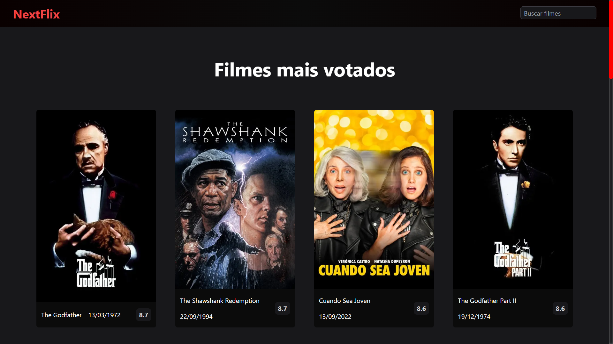
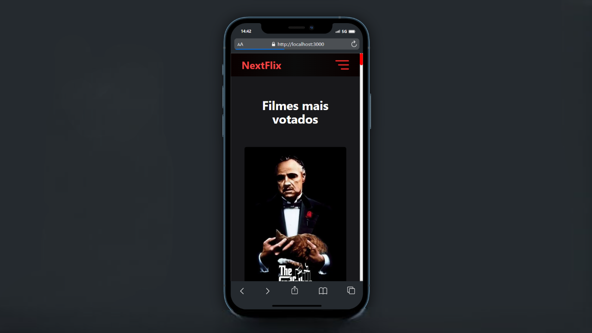

# Filmes

  
  

## Projeto

### Propósito

Criado com a intenção de treinar o uso de APIs.

### O que irá encontrar:

<ul>
  <li>
    Tela inicial com os filmes melhores classificados;
  </li>
  <li>
    Input para pesquisar por filmes;
  </li>
  <li>
    Página com informações a respeito do filme escolhido;
  </li>
  <li>
    Paginação dos resultados.
  </li>
</ul>

## Link de acesso

Veja esse projeto em execução: [demo](https://movies-dariomatias-dev.vercel.app/).

## Como usar

### Caso queira baixar, testar ou alterar o projeto, siga os seguintes passos:

#### Clonar

Primeiro clone o repositório com: git clone [link HTTPS ou SSH do repositório]

Pode conseguir esse link acessando o repositório que quer clonar, e apertando em um botão verde com o nome "<> CODE".

#### Baixar dependências

Depois baixe todas as dependências necessárias: npm i

#### Rodar

Rode o projeto com: npm run dev

## Screenshots

<h3>Desktop</h3>

<h3>Mobile</h3>

## 🛠 Tecnologias

As seguintes ferramentas foram usadas na construção desse projeto:

-   [TypeScript](https://www.typescriptlang.org/)
-   [TailwindCSS](https://tailwindcss.com/)
-   [Next.js](https://nextjs.org/)
-   [TMDB](https://www.themoviedb.org/)

 

## Autor

  <b>Dário Matias</b>

 
  Entre em contato!
 
 

